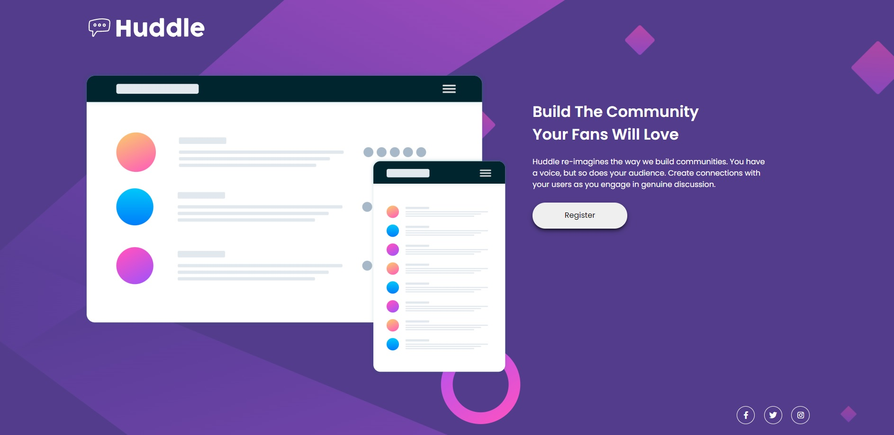

- Overview:
  - [Huddle Landing Page with Single Introductory Section Master]
  - [https://wella4life.github.io/Challenge_9_Easy/]
  - 
  - 

 - Users should be able to:
   - View the optimal layout for the site depending on their device's screen size
   - Hover stats on "Register" and "Social icons"

 - What I Learned:
   - Using a border doesn't help with how big the border is
   - Having each icon in its own div would help get the border almost perfect
   - Using :Before and getting each icon its own background to transparent with a white border helped
   - Getting header and social icons to "align-items" made it very easy to place them
 
 - What I Couldn't Do:
   - Massive size differences this time
   - Mobile version alignment differences
   - Mobile background forgot to switch it
